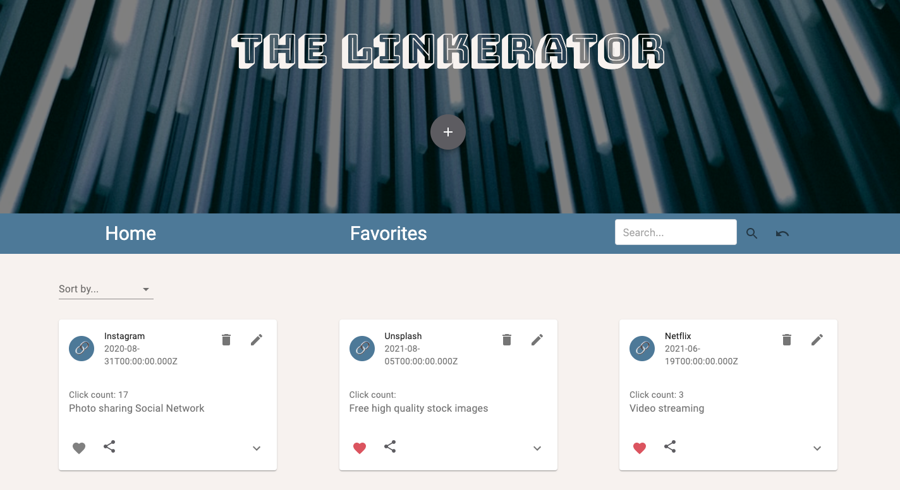

<h1 align="center">The Linkerator</h1>
<br>

> Browser-based bookmark manager allowing users to save and sort their favorite website links

<br>

## Deployment


### 🌐  [Live Site](https://eem-linkerator.herokuapp.com/)

  
<br>



  
## Tech Stack

**Client:** React

**Server:** Node, Express

**Database:** PostgreSQL

  
## Features

- Create/Edit links
- Favorite Links
- Sort Links

  
## Run Locally

Clone the project

```sh
  git clone https://github.com/ekrebs1/great-linkerator-1.git
```

Go to the project directory

```sh
  cd great-linkerator-1
```

Install dependencies

```sh
  npm install
```

Build database

```sh
  npm run db:build
```

Start Server

```sh
  server:dev
```

Open localhost:3000

```sh
npm run client:dev
```

  
## License

[](https://github.com/tterb/atomic-design-ui/blob/master/LICENSEs)
  
